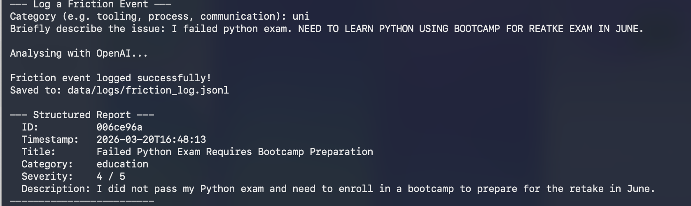
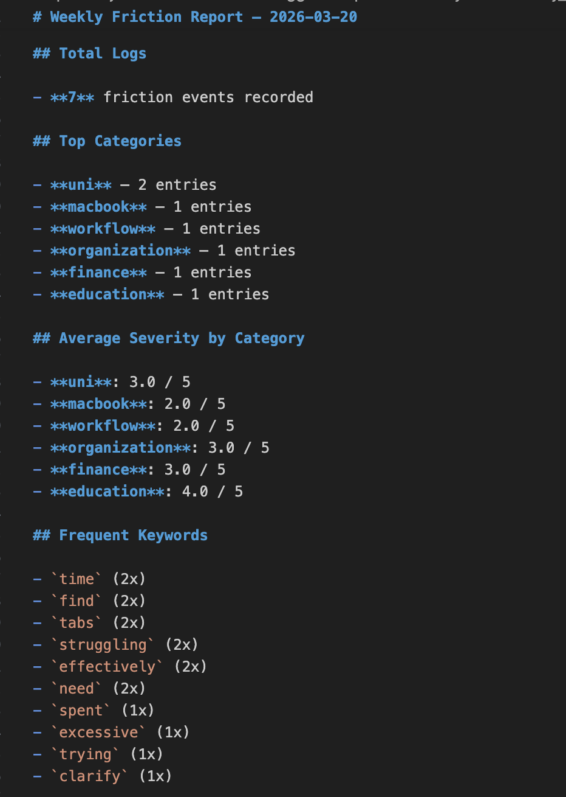
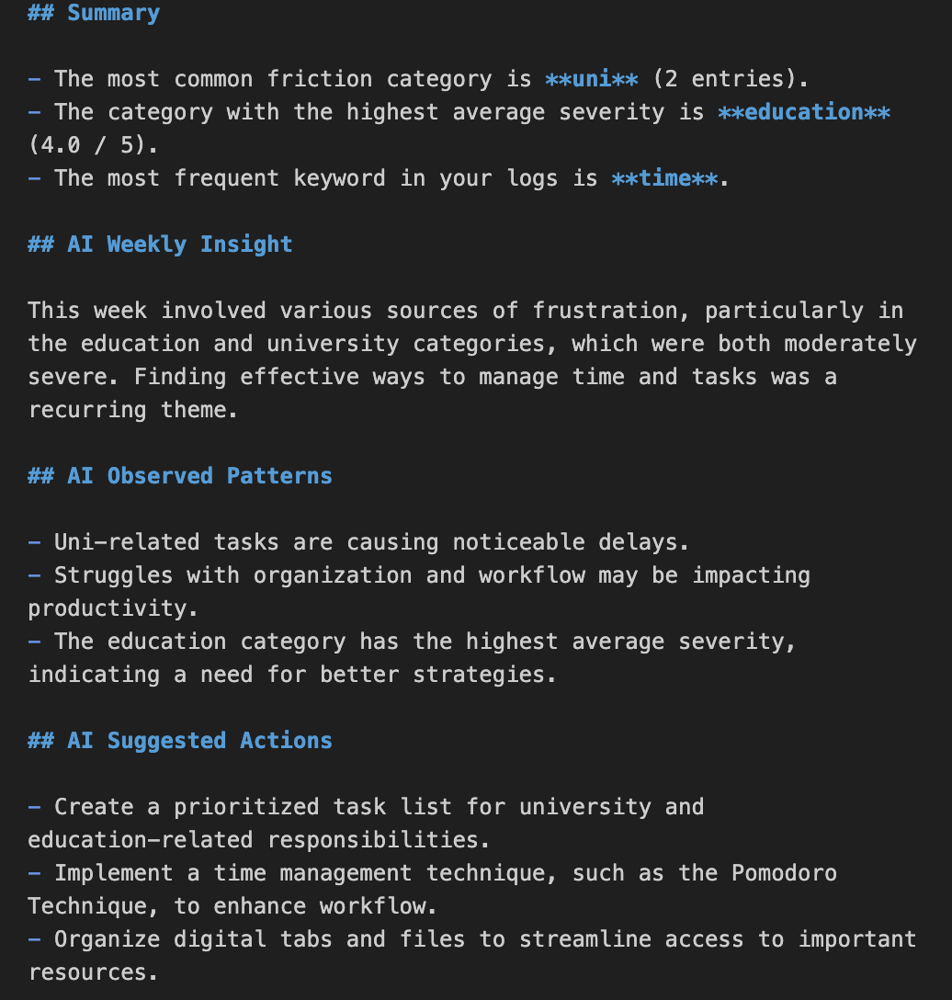

# Smart Friction Logger

A CLI tool I built to log the small things that slow me down — slow builds, repeated MacBook annoyances, confusing uni workflows, tooling that never quite works. You describe what happened, it uses OpenAI to structure the entry, and at the end of the week you can run a report to see what kept coming up.

---

## Why I Built It

I kept hitting the same friction — long build times, things breaking in the same way, uni tasks that took longer than they should — and I had no record of any of it. I wanted something I could log from the terminal in ten seconds without switching apps, and then look back on to see what was actually worth fixing. So I built it.

---

## What It Does

- **Logs friction events** — you describe what happened in plain text; it uses OpenAI to turn that into a structured entry with a title, category, description, and severity score (1–5)
- **Saves everything locally** — entries are stored as JSON lines in `data/logs/`; no database, no accounts
- **Detects patterns** — reads your logs and surfaces which categories and keywords keep showing up
- **Generates weekly reports** — writes a Markdown file to `reports/weekly/` with a breakdown of what came up most and an AI-generated section suggesting what to actually do about it
- **Works from the terminal** — interactive menu or direct flags (`--log`, `--patterns`, `--report`)
- **Terminal aliases** — `frictionlog`, `frictionreport`, `frictionpatterns` so you can run it from anywhere
- **Mac Automator launcher** — optional shortcut to log without opening a terminal at all

> Logs and reports are gitignored and stay local.

---

## How It Works

1. Run `python3 main.py --log` (or `frictionlog`)
2. Pick a category and describe the friction in plain text
3. The input goes to the OpenAI API, which returns a structured record: title, description, category, and severity
4. The record is appended to `data/logs/friction_log.jsonl`
5. When you run `--report`, it reads all your logs, finds patterns, sends a summary to OpenAI, and writes a weekly Markdown report to `reports/weekly/`

---

## Example Output

Logging a friction event:



Weekly report output:




---

## Tech Stack

| Layer | Tool |
|---|---|
| Language | Python 3.8+ |
| AI enrichment | OpenAI API (GPT) |
| Storage | JSONL flat files |
| Config | python-dotenv |
| CLI | sys.argv / argparse |

---

## Project Structure

```
smart-friction-logger/
├── main.py               # Entry point — run this
├── requirements.txt      # Python dependencies
├── COMMANDS.md           # Full command and alias reference
├── src/
│   ├── logger.py         # Collects raw friction input from the user
│   ├── storage.py        # Reads and writes local log and report files
│   ├── patterns.py       # Detects recurring categories and keywords
│   ├── insights.py       # Calls OpenAI to enrich events and generate insights
│   └── utils.py          # Shared helpers (timestamps, IDs, paths)
├── data/
│   └── logs/             # Raw event logs in JSONL format (gitignored)
└── reports/
    └── weekly/           # Generated weekly reports in Markdown (gitignored)
```

---

## How to Run Locally

**Requirements:** Python 3.8+, an OpenAI API key

```bash
# 1. Clone the repo
git clone https://github.com/your-username/smart-friction-logger.git
cd smart-friction-logger

# 2. Create and activate a virtual environment
python3 -m venv venv
source venv/bin/activate        # Windows: venv\Scripts\activate

# 3. Install dependencies
pip install -r requirements.txt

# 4. Add your OpenAI API key
echo "OPENAI_API_KEY=your-key-here" > .env

# 5. Run the app
python3 main.py
```

---

## Example Commands

```bash
# Interactive menu
python3 main.py

# Log a new friction event
python3 main.py --log

# View detected patterns across all logs
python3 main.py --patterns

# Generate and save this week's report
python3 main.py --report
```

With terminal aliases from `COMMANDS.md`:

```bash
frictionlog        # log a new event
frictionpatterns   # view patterns
frictionreport     # generate weekly report
```

> See [COMMANDS.md](COMMANDS.md) for the full reference including alias setup, troubleshooting, and git shortcuts.

---

## Example Workflow

```
$ frictionlog

Category: tooling
Describe the friction: The dev container takes 4 minutes to rebuild every time I switch branches.

Analysing with OpenAI...

--- Structured Report ---
  Title:       Slow dev container rebuild on branch switch
  Category:    tooling
  Severity:    4 / 5
  Description: Dev container rebuild takes ~4 minutes on each branch switch,
               interrupting flow and adding significant wait time per session.
-------------------------

$ frictionreport

Generating AI insights...
Weekly report generated successfully!
Saved to: reports/weekly/2026-03-20.md
```

The saved report includes a frequency table of categories, a keyword summary, and an AI-generated "What to do about it" section.

---

## What I Learned

- How the OpenAI API handles structured extraction from unstructured text — and where it needs more guidance
- What it actually takes to design a CLI that works both interactively and with flags
- Why append-only JSONL is a reasonable choice for a local log file without needing a database
- How to keep personal data out of version control properly, not just in theory
- That building a tool you actually use daily is a very different experience from building something for a spec

---

## Future Improvements

- Add a `--since` flag to filter logs by date range before generating a report
- Support multiple log files (one per day) and auto-merge for pattern analysis
- Export reports to PDF or send a weekly digest by email
- Add a simple tag system (`#deploy`, `#meeting`) for more granular filtering
- Build a lightweight web view to browse logs and reports in a browser
